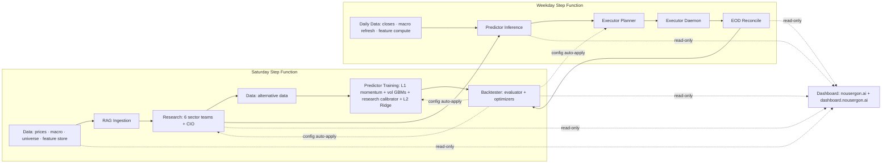
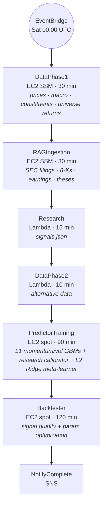
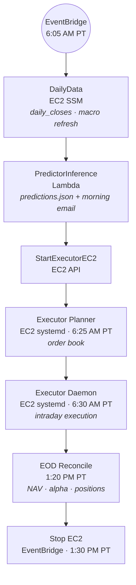

# Nous Ergon — Alpha Engine

> Part of [**Nous Ergon**](https://nousergon.ai) — Autonomous Multi-Agent Trading System. Repo and S3 names use the underlying project name `alpha-engine`.

Canonical system-overview entry point for the Nous Ergon Alpha Engine project. Six public module repos, one private config repo, one shared S3 bucket, one continuous feedback loop.

**[Public site →](https://nousergon.ai)** | **[Blog →](https://nousergon.ai/blog)** | **[Modules →](#modules)** | **[Architecture →](#system-architecture)**

---

## What this is

A multi-agent orchestration system that researches, decides, and acts — and measures and tunes itself in the process. Equities trading is the substrate: a domain where decisions are unambiguous, outcomes are continuously verifiable, and agentic behavior is observable end-to-end.

Four capabilities define the system:

- **Multi-agent orchestration** — six LangGraph sector teams, a CIO, and a macro economist scan the S&P 500+400 (~900 stocks) weekly. Each sector team runs a quant ReAct → qual ReAct → peer review flow before submitting 2–3 recommendations. The CIO gates new entrants per a configurable cap. Outputs at key stages are evaluated by a rubric-based LLM-as-judge layer.
- **Stacked meta-ensemble prediction** — three specialized Layer-1 models (LightGBM momentum, LightGBM volatility, and a research-score calibrator) feed a Layer-2 Ridge meta-learner alongside research-context and raw macro features. Predictions flow into a downstream risk-gated executor.
- **Autonomous self-improvement** — a backtester evaluates the system's own outputs each week, runs parameter sweeps, and writes four optimized configs back to S3. Research, predictor, and executor read those configs on cold-start; the system retunes itself weekly without manual intervention.
- **End-to-end measurement substrate** — signals are persisted to `research.db` and `signals.json`, predictions to `predictions/{date}.json`, fills to a SQLite trade log backed up to S3, and daily P&L to `eod_pnl.csv`. The presentation layer is a view, not a measurement layer; numbers source from existing module outputs.

The substrate is equities; the pattern is general. The orchestration, measurement, and learning loops apply anywhere multi-agent collaboration and durable instrumentation matter.

The current chapter is **Phase 2: Reliability Buildout** — making the measurement substrate trustworthy enough that Phase 3 (parameter tuning toward sustained outperformance) operates on solid ground. Long-term alpha (portfolio return minus SPY, risk-adjusted) is the eventual target Phase 3 is engineered to inflect toward; it is not a present-tense claim.

## Phase trajectory

This is the central narrative for everything you'll read across the repos and surfaces. **The system is currently in Phase 2.**

| Phase | Focus | Status |
|---|---|---|
| **Phase 1** | Build the system end-to-end | ✅ Complete — 6 repos, full pipeline running |
| **Phase 2** | Reliability + measurement buildout | 🟡 **Current** — incident retros, SF hardening, observability, autonomous feedback loop |
| **Phase 3** | Parameter tuning toward alpha | ⏳ Next — backtester→config feedback loop already wired |
| **Phase 4** | Live capital | ⏳ Gated on Phase 3 sustained outperformance |

**Phase 2 thesis:** before you can systematically generate alpha, you need to be able to systematically measure every component. The presentation layer everywhere leads with reliability and measurement — pipeline success rates, recovery times, signal/prediction/fill traceability, autonomous feedback-loop visibility — not with returns. Returns appear honestly as a Phase 2 baseline, contextualized as the metric Phase 3 is engineered to inflect.

## Roadmap — current state vs ideal state

High-level forward direction per module. Not a tactical checklist; this is where Phase 3+ is engineered to take each piece.

| Module | Today | Ideal state |
|---|---|---|
| **Data** | ~50 engineered features × ~900 tickers × 10y in ArcticDB; weekly refresh | Broader alternative-data, options-derived, and sentiment coverage; drift-monitored per feature group; sub-daily refresh where signal warrants it |
| **Research** | 6 sector teams + CIO + macro economist; weekly scan; rubric-based LLM-as-judge on key stages | Higher-cadence research (toward daily); broader judge rubric coverage with two-tier orchestration; conviction-driven mid-week rebalancing |
| **Predictor** | 3 specialized Layer-1 models (LightGBM momentum + LightGBM volatility + lookup-table research-score calibrator) feeding L2 Ridge; 21 features in production inference | All L1 components as real models (calibrator → GBM; regime model returns as LightGBM with triple-barrier labels); broader feature breadth in inference toward the ~50-feature store universe; ensemble diversity across model classes |
| **Executor** | Risk-gated paper trading via IB Gateway; 4 entry-trigger types; ATR trailing stops | Live capital (Phase 4); portfolio-level risk overlays beyond per-position gates; tax-aware position management |
| **Backtester** | Weekly evaluator + autonomous optimizers writing 4 configs to S3 | Causal attribution per signal source; regime-conditional config sets; counterfactual analysis |
| **Dashboard** | Read-only Streamlit; portfolio, signals, predictor, retros | Signal lifecycle view; feedback-loop visualization; feature store and RAG inventory pages; `/metrics` validation page |

Phase 3 begins when Phase 2 reliability metrics meet their gating criteria. Phase 4 (live capital) begins when Phase 3 demonstrates sustained outperformance under walk-forward validation.

## Modules

Each repo is a single module with one responsibility. Public READMEs follow a [shared template](templates/README_TEMPLATE.md); deeper code tours live in each repo's `OVERVIEW.md`.

| Module | Repo | Role | What it measures |
|---|---|---|---|
| **Data** | [`alpha-engine-data`](https://github.com/cipher813/alpha-engine-data) | Centralized ArcticDB feature store, macro indicators, alternative data; first step in both Step Functions | Feature coverage + freshness, data-quality flags |
| **Research** | [`alpha-engine-research`](https://github.com/cipher813/alpha-engine-research) | LangGraph multi-agent investment research — 6 sector teams + CIO + macro economist; ~900-stock weekly scan | Composite scores + sub-score attribution, LLM-as-judge rubric scores |
| **Predictor** | [`alpha-engine-predictor`](https://github.com/cipher813/alpha-engine-predictor) | Stacked meta-ensemble — Layer-1 LightGBM momentum + LightGBM volatility + research-score calibrator feed a Layer-2 Ridge meta-learner; 5-day market-relative alpha + veto gate | Ensemble IC (L2) + per-L1 component IC, calibration |
| **Executor** | [`alpha-engine`](https://github.com/cipher813/alpha-engine) | Risk-gated position sizing, intraday entry triggers (pullback / VWAP / support / time-expiry), trailing stops; IB Gateway via IBC | Fill stats, slippage, sizing decision attribution |
| **Backtester** | [`alpha-engine-backtester`](https://github.com/cipher813/alpha-engine-backtester) | Signal quality evaluation, regime + score-bucket analysis, autonomous optimizers writing four configs to S3 weekly (scoring weights, executor params, predictor veto threshold, research params) | Signal accuracy 10d/30d, attribution, optimizer convergence |
| **Dashboard** | [`alpha-engine-dashboard`](https://github.com/cipher813/alpha-engine-dashboard) | Read-only Streamlit monitoring — portfolio, signals, system report card; powers both [nousergon.ai](https://nousergon.ai) (public) and `dashboard.nousergon.ai` (private, Cloudflare Access) | (Surfaces what the others measure) |

Plus a private [`alpha-engine-config`](https://github.com/cipher813/alpha-engine-config) repo holding proprietary scoring weights, agent prompts, model parameters, and other tuned values. **Disclosure boundary** is per-module: architecture and approach are public; specific weights / prompts / thresholds are private.

## System architecture

Six modules run on AWS (Lambda + EC2), connected through one shared S3 bucket (`alpha-engine-research`). Two Step Functions enforce sequential execution with timeout guards.

### Saturday pipeline — `alpha-engine-saturday-pipeline`

Trigger: EventBridge `cron(0 0 ? * SAT *)` — Sat 00:00 UTC (Fri 5–8 PM PT).

### Weekday pipeline — `alpha-engine-weekday-pipeline`

Trigger: EventBridge `cron(5 13 ? * MON-FRI *)` — 6:05 AM PT.

### Autonomous feedback loop

The backtester is the system's learning mechanism. Each week it analyzes signal accuracy, runs param sweeps, and auto-applies optimized configs to S3 for downstream modules to read on cold-start:

| Config | Read by | Optimizer |
|---|---|---|
| `config/scoring_weights.json` | Research | Weight optimizer (data-driven scoring weight recommendations) |
| `config/executor_params.json` | Executor | 60-trial random search over 6 risk params, ranked by Sharpe |
| `config/predictor_params.json` | Predictor | Veto threshold auto-tune |
| `config/research_params.json` | Research | Signal boost params (deferred until 200+ samples) |

Fully autonomous, no manual intervention required. **This is the substrate Phase 3 alpha tuning operates on.**

## Public + private surfaces

| Surface | Audience | Access |
|---|---|---|
| [**nousergon.ai**](https://nousergon.ai) | Public — recruiters, interviewers, blog readers | Open; near real-time |
| [**nousergon.ai/blog**](https://nousergon.ai/blog) | Public deep-dive case studies | Open |
| **dashboard.nousergon.ai** | Live demo during interviews — Signal Lifecycle, Feedback Loop, Feature Store, RAG inventory | Cloudflare Access (Zero Trust) |
| **GitHub** (this org) | Code review, integration audits | Open — [cipher813/alpha-engine\*](https://github.com/cipher813?tab=repositories&q=alpha-engine) |

Disclosure boundary: configs / prompts / weights / proprietary scoring logic stay private (in `alpha-engine-config`); architecture and approach are public.

## Headline metrics

Live numbers live on [**nousergon.ai**](https://nousergon.ai) with a `/metrics` validation page where every claimed metric drills through to its source (S3 path, query, calculation). Phase 2 reliability metrics (SF success rate, recovery time, test surface, deploy cadence) lead the home page; quality metrics (signal accuracy, ensemble IC) come next; return metrics appear last with the Phase 2 baseline framing.

The presentation layer is a *view* — every number sources from existing system outputs (backtester evaluator, predictor `metrics/latest.json`, EOD reconcile, LLM-as-judge, SF execution history, health-check Lambda). No ad-hoc dashboard computation.

## In this repo

| Folder | Purpose |
|---|---|
| [`branding/`](branding/) | Single source of truth for the Nous Ergon design system — palette, typography, brand banner, badge bar, OG image template, Plotly chart conventions |
| [`templates/`](templates/) | Locked README + OVERVIEW.md templates that all 6 module repos inherit |
| [`scripts/`](scripts/) | System-wide deploy changelog aggregator + utilities |
| [`blogs/`](blogs/) | Source for nousergon.ai blog posts |
| [`RUNBOOKS.md`](RUNBOOKS.md) | Deployment runbooks |
| [`LIVE_TRADING_CHECKLIST.md`](LIVE_TRADING_CHECKLIST.md) | Pre-go-live operational checklist |
| `private/` | Gitignored — plans, audits, interview kit, sensitive notes |

## Blog posts

| # | Title | Date | Topic |
|---|-------|------|-------|
| 1 | [Building an Autonomous Alpha Engine with AI](https://nousergon.ai/blog/building-autonomous-alpha-engine) | 2026-03-15 | System overview, 3-layer architecture |
| 2 | [Multi-Agent Research: How 6 LLM Teams Analyze 900 Stocks](https://nousergon.ai/blog/multi-agent-research) | 2026-03-27 | ReAct agents, RAG, sector specialization |

## System audits

Periodic full-system audits (latest first):

| Date | Audit | Focus |
|---|---|---|
| 2026-04-08 | [System Audit](alpha-engine-system-audit-260408.md) | Full state assessment, 704 tests, 94% maturity |
| 2026-04-08 | [System Docs](alpha-engine-system-docs-260408.md) | Comprehensive technical reference (1,508 lines) |
| 2026-04-08 | [Evaluation Plan](alpha-engine-system-plan-eval-260408.md) | Component grading methodology |
| 2026-04-08 | [Comms Plan](alpha-engine-comms-plan-260408.md) | Documentation restructure plan |
| 2026-04-04 | [System Audit](alpha-engine-system-audit-260404.md) | Post-hardening baseline |

## Branding + naming

- **Public brand:** Nous Ergon (νοῦς ἔργον — *"mind at work"*)
- **Underlying project name:** Alpha Engine
- **Canonical tagline:** *Autonomous Multi-Agent Trading System*

Repos and S3 names use `alpha-engine` because that's the project's underlying name; external surfaces use Nous Ergon. Every public repo opens with the same one-line disambiguation banner so first-time readers don't get confused.

## Contact

Portfolio project — issues + PRs not actively monitored. For inquiries: see contact on [nousergon.ai](https://nousergon.ai).

## License

MIT — see [LICENSE](LICENSE).
