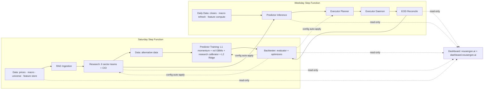
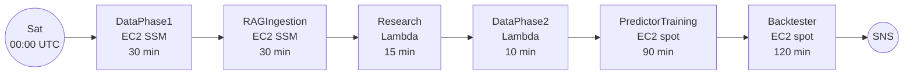
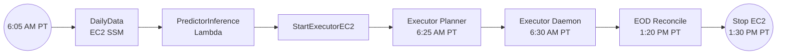

# Nous Ergon — Alpha Engine

> Part of [**Nous Ergon**](https://nousergon.ai) — Autonomous Multi-Agent Trading System. Repo and S3 names use the underlying project name `alpha-engine`.

System-overview entry point. Detailed module documentation, blog posts, the live dashboard, and metrics validation live on the public site.

**[nousergon.ai](https://nousergon.ai)** · **[Blog](https://nousergon.ai/blog)** · **[Modules](#modules)** · **[Architecture](#system-architecture)**

---

## What this is

A multi-agent orchestration system that researches, decides, and acts — and measures and tunes itself in the process. Equities trading is the substrate: a domain where decisions are unambiguous, outcomes are continuously verifiable, and agentic behavior is observable end-to-end.

Four capabilities define the system:

- **Multi-agent orchestration** — six LangGraph sector teams, a CIO, and a macro economist scan the S&P 500+400 (~900 stocks) weekly. Each sector team runs a quant ReAct → qual ReAct → peer review flow before submitting 2–3 recommendations. The CIO gates new entrants per a configurable cap. Outputs at key stages are evaluated by a rubric-based LLM-as-judge layer.
- **Stacked meta-ensemble prediction** — three specialized Layer-1 models (LightGBM momentum, LightGBM volatility, and a research-score calibrator) feed a Layer-2 Ridge meta-learner alongside research-context and raw macro features. Predictions flow into a downstream risk-gated executor.
- **Autonomous self-improvement** — a backtester evaluates the system's own outputs each week, runs parameter sweeps, and writes four optimized configs back to S3. Research, predictor, and executor read those configs on cold-start; the system retunes itself weekly without manual intervention.
- **End-to-end measurement substrate** — signals are persisted to `research.db` and `signals.json`, predictions to `predictions/{date}.json`, fills to a SQLite trade log backed up to S3, and daily P&L to `eod_pnl.csv`. The presentation layer is a view, not a measurement layer; numbers source from existing module outputs.

The substrate is equities; the pattern is general. The orchestration, measurement, and learning loops apply anywhere multi-agent collaboration and durable instrumentation matter.

## Phase trajectory

| Phase | Focus | Status |
|---|---|---|
| **Phase 1** | Build the system end-to-end | ✅ Complete — 6 repos, full pipeline running |
| **Phase 2** | Reliability + measurement buildout | 🟡 **Current** — incident retros, SF hardening, observability, autonomous feedback loop |
| **Phase 3** | Parameter tuning toward alpha | ⏳ Next — backtester→config feedback loop already wired |
| **Phase 4** | Live capital | ⏳ Gated on Phase 3 sustained outperformance |

The presentation layer leads with reliability and measurement, not returns. Long-term alpha — portfolio return minus SPY, risk-adjusted — is the metric Phase 3 is engineered to inflect.

## Modules

| Module | Repo | Today | Where it's headed |
|---|---|---|---|
| **Data** | [`alpha-engine-data`](https://github.com/cipher813/alpha-engine-data) | ~50 features × ~900 tickers × 10y in ArcticDB; weekly refresh | Broader alternative-data, options-derived, and sentiment coverage; drift-monitored per feature group; sub-daily refresh where signal warrants it |
| **Research** | [`alpha-engine-research`](https://github.com/cipher813/alpha-engine-research) | 6 sector teams + CIO + macro economist; weekly scan; rubric-based LLM-as-judge on key stages | Higher-cadence research (toward daily); broader judge rubric coverage with two-tier orchestration; conviction-driven mid-week rebalancing |
| **Predictor** | [`alpha-engine-predictor`](https://github.com/cipher813/alpha-engine-predictor) | Layer-1 LightGBM momentum + LightGBM volatility + research-score calibrator → Layer-2 Ridge meta-learner; 21 features in production inference | Research-score calibrator promoted from lookup table to a GBM; regime model returns as a real model once it clears its named baseline; broader feature breadth in inference toward the ~50-feature store universe |
| **Executor** | [`alpha-engine`](https://github.com/cipher813/alpha-engine) | Risk-gated paper trading via IB Gateway; 4 entry-trigger types; ATR trailing stops | Live capital (Phase 4); portfolio-level risk overlays beyond per-position gates; tax-aware position management |
| **Backtester** | [`alpha-engine-backtester`](https://github.com/cipher813/alpha-engine-backtester) | Weekly evaluator + autonomous optimizers writing 4 configs to S3 (scoring weights, executor params, predictor veto, research params) | Deeper attribution showing which signal sources actually drive returns; regime-conditional config sets; more frequent retuning cadence as data accrues |
| **Dashboard** | [`alpha-engine-dashboard`](https://github.com/cipher813/alpha-engine-dashboard) | Read-only Streamlit; portfolio, signals, predictor, retros — powers nousergon.ai (public) and dashboard.nousergon.ai (private, Cloudflare Access) | Signal lifecycle view; feedback-loop visualization; feature store + RAG inventory; `/metrics` validation page |

Plus a private [`alpha-engine-config`](https://github.com/cipher813/alpha-engine-config) repo holding proprietary scoring weights, agent prompts, model parameters, and other tuned values. Disclosure boundary: architecture and approach are public; specific weights / prompts / thresholds are private.

## System architecture

### Saturday pipeline — `alpha-engine-saturday-pipeline`

EventBridge `cron(0 0 ? * SAT *)` — Sat 00:00 UTC (Fri 5–8 PM PT).

### Weekday pipeline — `alpha-engine-weekday-pipeline`

EventBridge `cron(5 13 ? * MON-FRI *)` — 6:05 AM PT.

### Autonomous feedback loop

The backtester is the system's learning mechanism. Each week it analyzes signal accuracy, runs param sweeps, and auto-applies optimized configs to S3 for downstream modules to read on cold-start.

| Config | Read by | Optimizer |
|---|---|---|
| `config/scoring_weights.json` | Research | Weight optimizer (data-driven scoring weight recommendations) |
| `config/executor_params.json` | Executor | 60-trial random search over 6 risk params, ranked by Sharpe |
| `config/predictor_params.json` | Predictor | Veto threshold auto-tune |
| `config/research_params.json` | Research | Signal boost params (deferred until 200+ samples) |

Fully autonomous, no manual intervention required. This is the substrate Phase 3 alpha tuning operates on.

## License

MIT — see [LICENSE](LICENSE).
